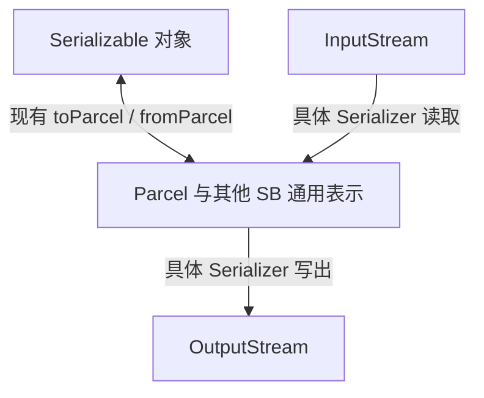

# 各 NS 的最小能力：core.serialization（§4.6）

> 本文件是 [STDLIB.md](../STDLIB.md)（Rigi 标准库 MVP 设计）的章节拆分，§ 编号与原文件一致；总目录与章节索引见该索引文档。

### 4.6 `core.serialization`

包含现有 `Serializable`、`Temporary`、`Parcel`、`fromParcel`、`deepCopy`，新增 `Serializer` 抽象基类及必要的公共配置、异常。`SerializationBase` 修饰器沿用现有 `core` 声明位置，不因职责归属而迁移。

#### 4.6.1 通用表示

SB 是具备 `SerializationBase` 能力的一组标准库类型，不是名叫 `SB` 的公共基类。
Parcel 是其中的对象表示；标量、String、Array、List、Map 等同属已有 SB 体系。
`Serializable` 与 `SerializationBase` 是不同能力，约束不能互相替代。

所有格式复用这套表示。格式内部可以有 token 和解析状态，但不能要求调用者使用另一套公开 DTO 树。



这里的 SB 是设计术语，不能直接写成尚不存在的 Rigi 返回类型。

**已确定的动态访问契约：**

- 格式层用 `Any?` 表达动态根值：null 合法，非 null 值须在运行时验证为格式支持的 SB 表示，其内容也须满足递归表示要求。不因签名使用 Any 就接受任意业务对象。
- 保留 Parcel 的类型化 `getElement\<T with SerializationBase>` / `setElement\<T with SerializationBase>`，补充动态读取、动态写入及存在性查询。动态写入执行同样的字段名和 SB 值检查；存在性查询区分“键不存在”和“键存在且值为 null”。
- Parcel 的动态读取、`valueAtIndex` 和迭代均返回实际 null，不暴露内部哨兵。迭代项的值类型为 `Any?`，即 `Pair\<String, Any?>`；公开字段计数和迭代只包含业务字段。
- Array/List/Map 补充格式实现所需的最小动态遍历、类型查询和构造能力。保留闭合泛型参数及可空信息，不能把 `List\<i32>` 强转为 `List\<Any?>`，也不能把擦除后的 Any 当成已获得静态 `Serializable` 证明。
- 不引入另一套公开 JSON 对象树；token、解析状态和实现内部的载荷结构不改变这一要求。

#### 4.6.2 Serializer 的两层职责

**已确定的公共签名：** 以下是普通函数的接口形状，类型名按所属 NS 导入；不是已存在的实现。

```rigi
// Serializer 的抽象格式方法
pub abstract func read(input: InputStream): Any?
pub abstract func write(value: Any?, output: OutputStream)

// Serializer 的对象便利方法
pub func serialize\<T with Serializable>(value: T, output: OutputStream)
pub func deserialize\<T with Serializable>(input: InputStream): T
```

抽象格式层从 InputStream 建立 SB 表示，将 SB 表示写入 OutputStream，并报告格式错误、表示不支持和限制超出。`read` / `write` 支持 null 根值；返回非可空 T 的对象入口遇到 null 根值报错，不构造默认对象。
调用者传入的流始终按 §4.4 借用，不由 Serializer 关闭；便利入口内部创建的临时流由该入口负责清理。
序列化成功返回前完成本次编码并将自身缓冲全部交给传入的 OutputStream，但不主动调用该流的 `flush()`；由调用者决定何时完成最终刷新。内部临时包装器的清理也不能意外触发调用者流的刷新，不能直接套用会逐层 flush 的输出包装器收尾来绕过此边界。

基类的对象便利层：

- 序列化 `T with Serializable` 时调用 `value:Serializable.toParcel()`，再交给格式层。格式实现区分对象字段、基元载荷和集合载荷，不把内部载荷字段当成业务 JSON 成员。
- `deserialize` 先取得通用表示并验证对象入口需要的 Parcel，再调用严格的 `fromParcel\<T>`。JSON 中缺少对象类型标识、但调用者已经知道目标类型时，使用 §4.7 的 `readAs`；不能先按无目标类型的默认值解析，再靠 `fromParcel` 做类型转换。
- 对象转换复用既有对象编解码机制并落实 §4.6.3 的契约收紧。JsonSerializer 的对象入口使用默认树模式；其公开入口不接受 `loopedRefEnabled`。
- String/内存缓冲区便利入口通过编码器/内存流组合，复用同一实现。

Serializer 基类不提供编码选择 API，也不提供 `loopedRefEnabled` 参数；不能通过继承让 JsonSerializer 获得该参数。既有 `toParcel`、`fromParcel`、`deepCopy` 的图模式参数继续保留。JSON 专用的目标类型读取、是否保留类型信息及编码配置见 §4.7。

#### 4.6.3 与已有 API 衔接

**已确定的 Parcel 字段键契约：**

Parcel 的字符串字段键必须是合法的 Rigi 字段名称，与当前源码字段声明使用同一固定 BMP 字母（Lu/Ll/Lt/Lm/Lo）及十进制数字（Nd）快照：首位仅字母或 `_`，其余还可为数字。该快照取自 Windows .NET 10.0.11 / Linux .NET 10.0.12 的 `char` 分类，不等同于 Unicode 17 全量分类；当前词法不接纳补充平面字符，即使它们是字母。升级 Unicode 类别必须同步更新前端、Parcel、测试与 [序列化规范 §20.6](../SYNTAX/13-serialization.md)。中文、希腊字母和字母后阿拉伯数字合法；空字符串、`a.b`、首位阿拉伯数字、emoji、标点及组合符不合法。不能把任意字符串字典当作 Parcel 字段表，Map 的业务键不受该规则限制。

这是对 Parcel 字段键的契约收紧，实现时须同步 [序列化规范 §20.6](../SYNTAX/13-serialization.md)。现有 String Map 会将业务键直接写入 Parcel，内部编码还使用 `..value`、`..case` 及图模式的 `..id`、`..ref`、`..data`；这些路径必须一起调整，不能仅在现有 `setElement` 上追加校验。

**已确定的元数据隔离：** 类型、枚举 case、基元/集合载荷及图引用信息使用受控的独立元数据访问面，不进入公开业务字段表。所有 Map 的内部表示统一使用有序键值条目序列，取消 String 键直接摊平为 Parcel 字段的特例；保留键值的真实类型，不调用键的 `toString()`。格式层可以访问必要的类型和载荷信息，但不能把旧的 `..value`、`..case`、`..id`、`..ref`、`..data` 原样输出为 JSON 业务成员。

**已确定的严格恢复契约：**

- `fromParcel\<T>` 要求表示中的类型与目标声明对应，不执行任何显式或隐式的值类型转换。此规则直接取代现有宽松恢复行为，不保留默认转换，也不另加可选的“严格模式”。
- 例如目标字段为 i32，Parcel 中的 i64 值 `3` 和 double 值 `3.0` 均不能恢复为该字段；禁止整数宽度转换、浮点截断、溢出回绕、String/bool 与数值互转及用户定义转换。验证必须发生在可能转换的 cast 之前，不能把现有 cast 当成类型检查。
- 集合的逻辑类型、闭合泛型参数、元素/键值类型及可空性按表示契约逐层检查；不能把 List 当作 Array，或通过转换元素来凑成目标类型。由合法的集合载荷重建对应集合属于解码，不是集合类型互换。
- 对象保留实际类型；已允许的多态恢复仍要求实际类型已登记、具备 Serializable 且可赋给目标声明。恢复派生对象不调用用户转换，也不把对象改造成另一个类型。
- 业务字段集合必须与所恢复实际类型的应序列化字段集合完全一致：缺失、多余、类型不匹配均报错，可空字段也必须显式存在。null 只可用于可空声明；不能用字段初始值填补缺失项。`@Temporary` 字段继续遵循既有排除及懒恢复规则，元数据不计入业务字段集合。
- 这些检查适用于公共 `fromParcel` 路径，包括深复制、消息复制和显式图模式；合法快照的复制及别名语义保持原有规定。树模式与图模式仍须匹配，图引用信息不能静默丢弃，恢复结果不共享输入表示中的可变内容。

**反射与实现边界：** 类型元信息须能查询实际类型的规范标识、Serializable 能力、参与序列化的字段及各字段的声明类型，并保留泛型实参、可空性、容器键值/元素类型和枚举 case 信息。JSON 通过这些通用 API 判断成员应读为对象还是 Map、数字应构造为何种宽度。字段筛选与已有 Serializable 合成规则一致，不另建 JSON 专用字段规则。

现有公开反射面提供 `typeOf` / `Type\<T>`、类型检查和动态构造，但尚不足以查询上述字段信息；实现时补齐通用反射能力，并同步类型系统规范。对象创建和恢复继续经过 Serializable 的编解码入口，不要求 JSON 自行绕过构造规则写字段。

流式读写不改变此设计会构造 SB 树的事实。首版逐块读取字节/写出文本，反序列化仍可能持有完整树，不承诺任意大对象的常量内存解析。

