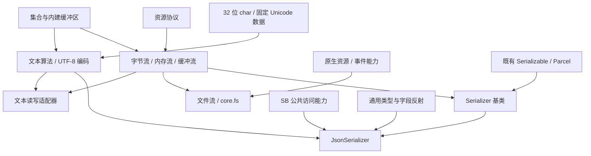

# 依赖与代码组织（§5）

> 本文件是 [STDLIB.md](../STDLIB.md)（Rigi 标准库 MVP 设计）的章节拆分，§ 编号与原文件一致；总目录与章节索引见该索引文档。

## 5. 依赖与代码组织

### 5.1 功能依赖

下图箭头表示“用于构建右侧能力”，不是整个现有 NS 声明关系的严格 DAG：

现有集合序列化标注、基础原子设施等已有跨 NS 引用，不借本次规划强制拆成无环声明图。
保持三个方向：编码器不依赖流，通用流不依赖文件系统，公共序列化层不依赖 JSON 实现。

### 5.2 源文件组织

- 公共实现放在 `stdlib/core/`，较大功能可使用 `text/`、`io/`、`fs/`、`serialization/json/` 等子目录；目录本身不定义 NS。
- 既有文件无需一次性搬迁，避免纯目录调整掩盖行为改动。
- 辅助类型优先 private/internal，不扩大解析状态和平台句柄布局为公共 API。
- 新文件经现有 EmbeddedResource 自携标准库机制编译，验证发布产物实际包含它们。

